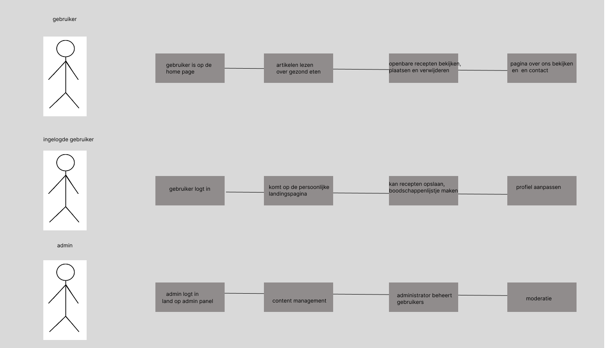

# Fase 3: Ideate (Oplossingen bedenken)
 
## 1. Concepten
* **How-Might-We vraag:** 
- hoe kunnen we ervoor zorgen dat gen z gebruikt gaat maken van de website.
* **Concept 1:** [de interface er zo uit laten zien dat het gen z gebruikers aantrekt]
* **Concept 2:** [de website gebruikservriendelijk maken]
* **Concept 3:** [de website moet snel, mobielvriendelijk en direct helder zijn.]
* **Concept 4**  []
 
## 2. Conceptkeuze & Onderbouwing
*Welk concept gaan we bouwen en waarom sluit dit het beste aan bij de PvE
uit de Define fase?*

 
## 3. User Flow (Visueel)
