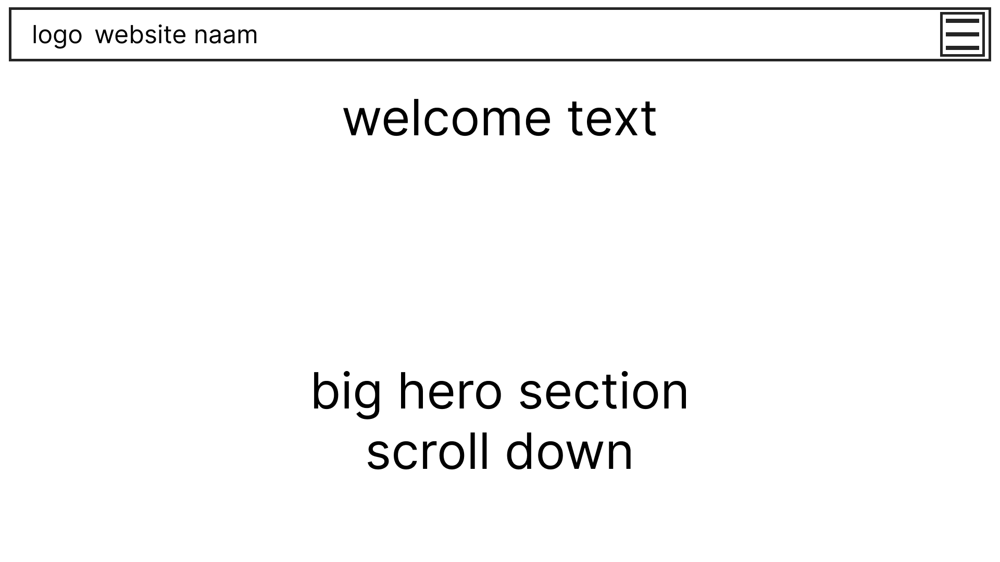
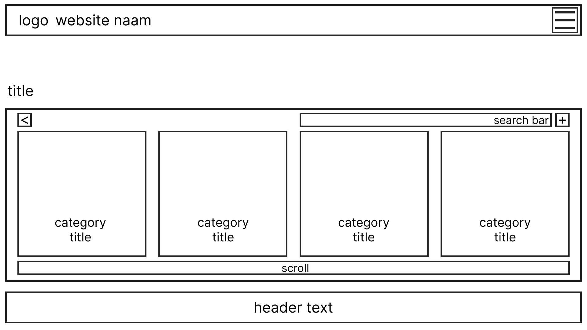
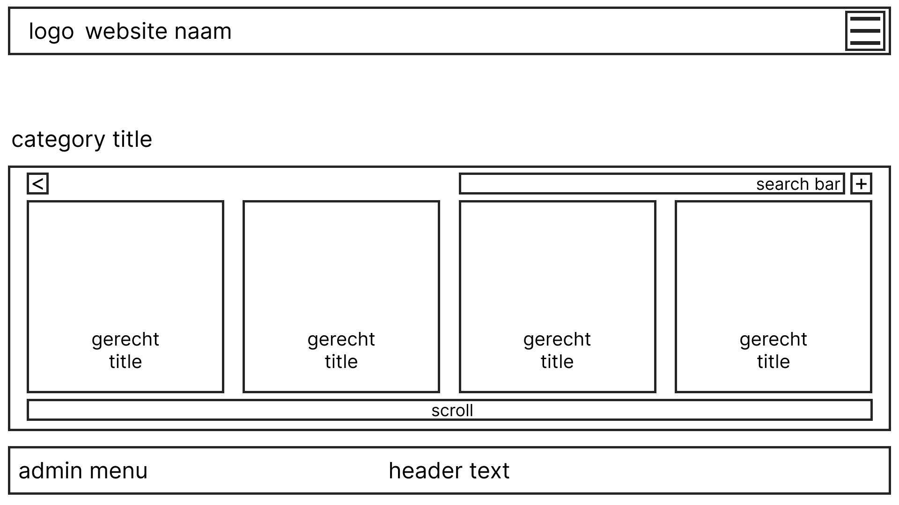
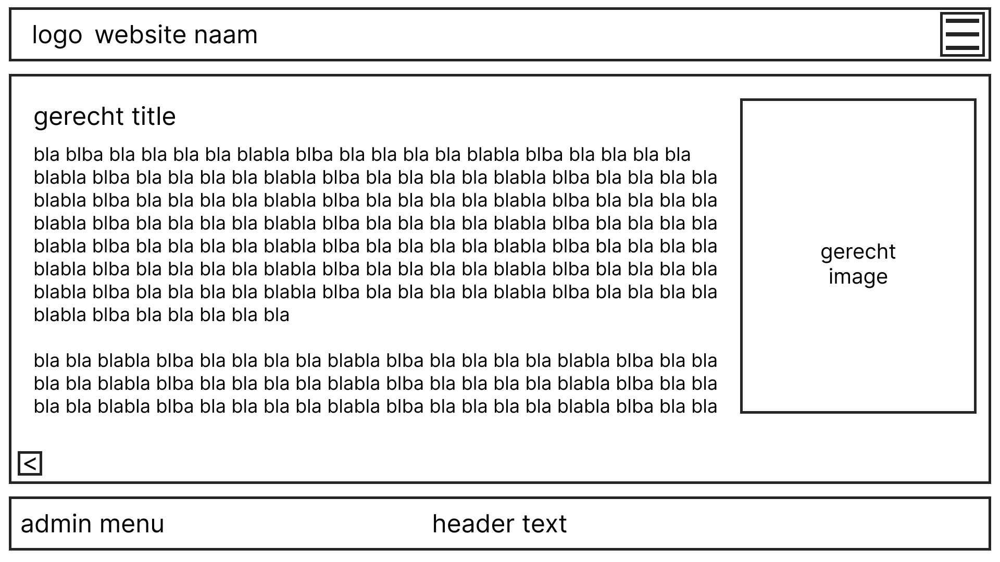
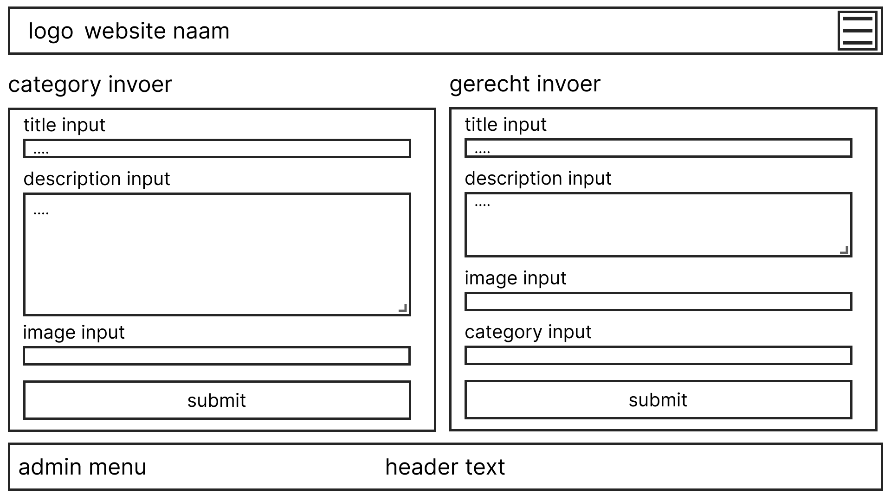
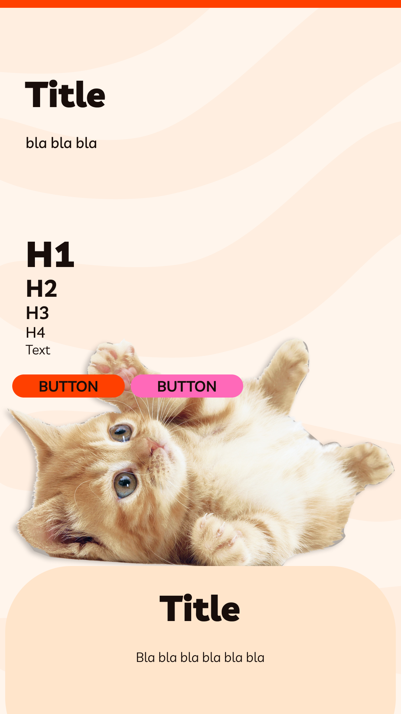
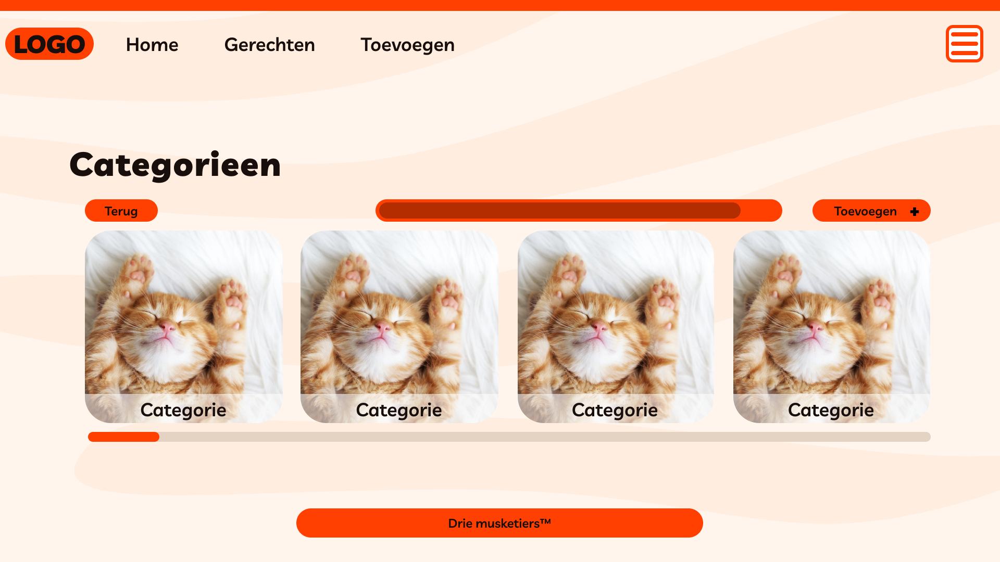

# Fase 4: Prototype (Ontwerp & Techniek)

 
## 1. Wireframes (Lo-Fi)

 
## 2. Visual Design (Hi-Fi)

 
## 3. Technische Architectuur
* **Frontend:** [Bijv. HTML, CSS, Vanilla JS]

* **Backend/Data:** [Bijv. Lokale JSON of Externe API]